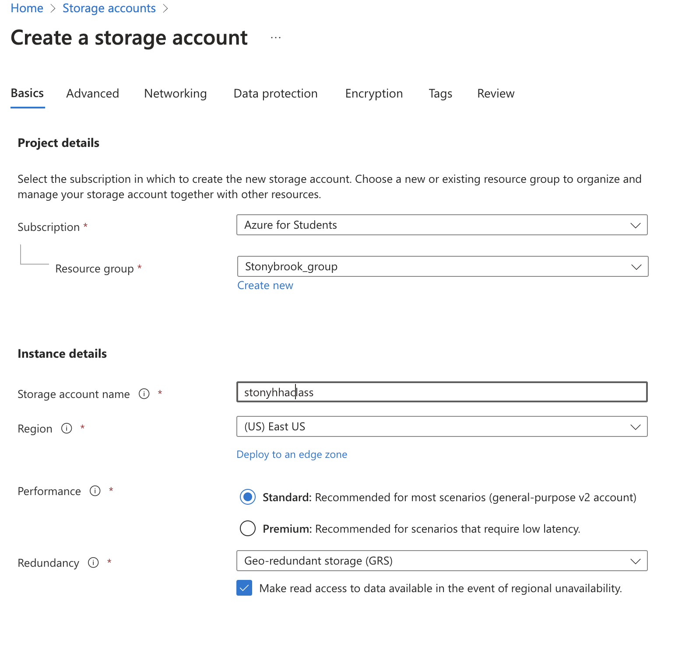

# flask_5_tailwind

### Your design rationale and principles followed.
- Create App.py File
- Import necessary packages
- Created database with db.py
- 
### Azure
- Create Storage
- Create Container
- Create CDN

